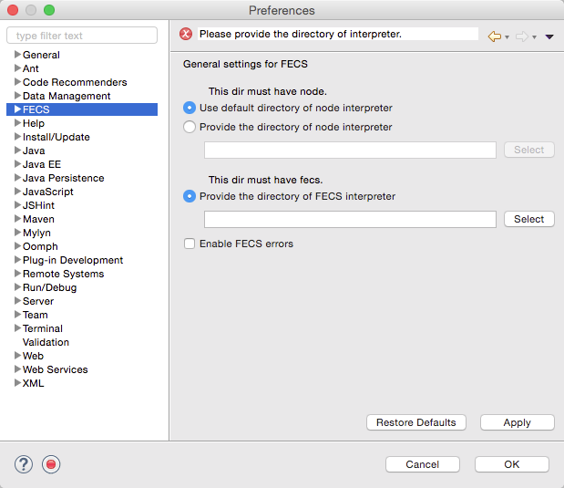
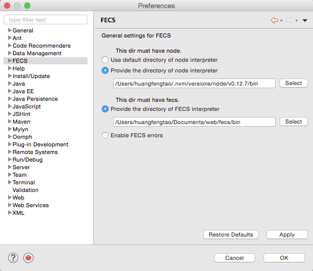
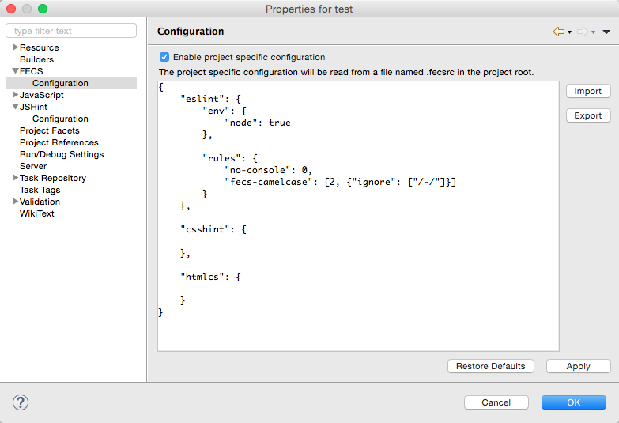
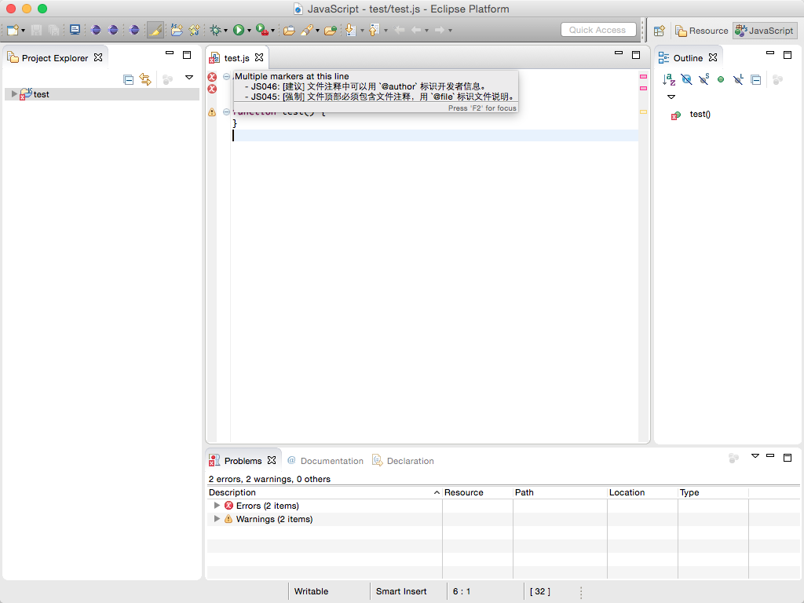

# fecs-eclipse

本插件在 [jshint-eclipse](https://github.com/eclipsesource/jshint-eclipse) 插件的基础上，进行修改和扩展。

插件实现方式：通过 Java 执行命令行，获取控制台输出并展示。

执行的命令行为：

```[nodeDir]node [fecsDir]fecs [options]```

通过 Preferences 的设置来获取 ```[nodeDir]``` ```[fecsDir]``` 的值

## 使用前提

+ Eclipse 3.6 或更新。（测试过 Mars，Helios 原则上也是可以的）
+ 安装 [Node.js](https://nodejs.org/download/) ，安装 [fecs](https://github.com/ecomfe/fecs) 。

## 安装（更新）方式

在 help 选项卡的 Install New Software 下进行安装

+ 本地安装（更新）

下载该项目代码，点击 Add -> Local... -> 打开项目的 com.eclipsesource.fecs.update 目录 -> OK

+ 在线安装（更新）

在 Work with 一栏填写 update 网址：http://ecomfe.github.io/fecs-eclipse/update/


## 使用方法

### 配置

在偏好设置（Preferences）中设置 Node.js 和 FECS 的 bin 目录：



**配置 Node.js 的 bin 目录。**

+ Use default directory of node interpreter
	
	这个选项表示 Eclipse 可以获得系统环境变量，```[nodeDir] = ""```，执行的命令行为 ```node [fecsDir]fecs [options]```

+ Provide the directory of node interpreter

	把选取的目录赋值给 ```[nodeDir]``` 。

**配置 FECS 的 bin 目录。**

+ Provide the directory of fecs interpreter

	把选取的目录赋值给 ```[fecsDir]``` 。
	


配置完没有提示错误信息则可以正常使用。

### 启用

右键项目进入 property ，勾选 Enable FECS 并应用，即可启用插件。

可设置插件检查及忽略的文件。

插件的默认配置中，检查项目中的 css, html, js, less 文件，过滤项目中的各种压缩文件和模板文件。具体默认配置如图。（**注意：该插件不检查默认忽略的文件类型，及时将其从 exlcude 移除并添加至 include 中也不会检查。**）


在 Configuration 子选项卡可以导入 .fecsrc 文件更细粒度的配置



### 代码检查

如图



### 代码格式化


可以通过点击工具栏的这两个按钮进行格式化（左侧的图标是格式化当前打开的文件，快捷键是 command + 6 或者 ctrl + 6，暂不支持快捷键自定义；右侧的图标是格式化左侧选中的项目/文件夹/文件）

**格式化后不满意可通过回退来恢复原先文件内容**，使用格式化项目或者文件夹这个功能时，property 的过滤器会起作用。
